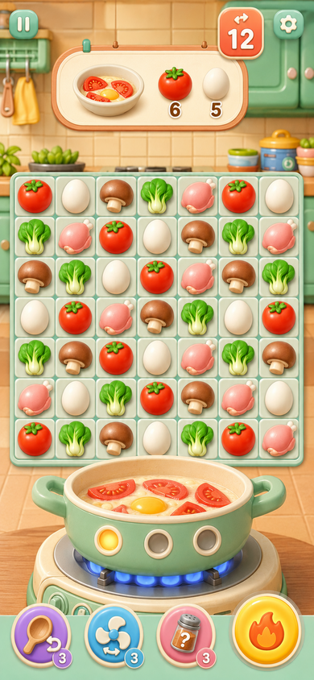
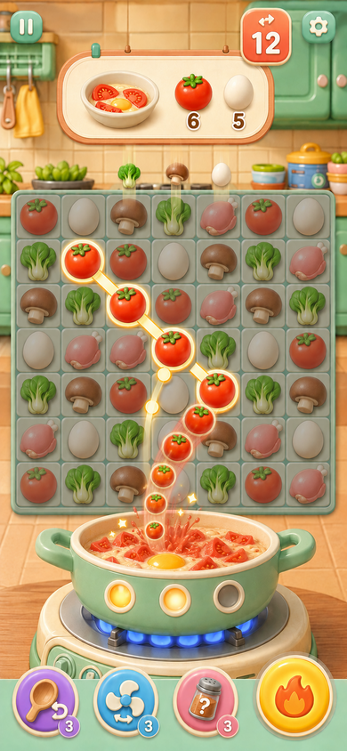
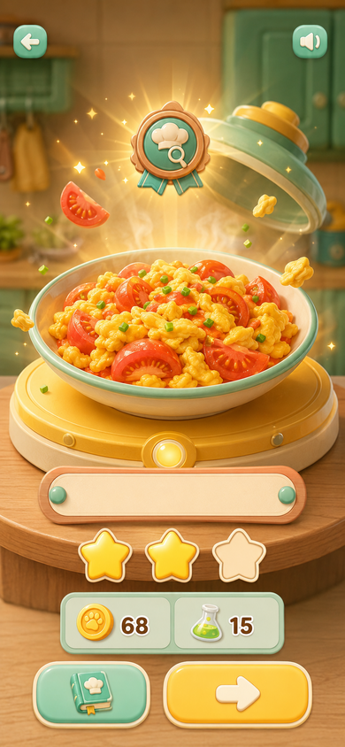
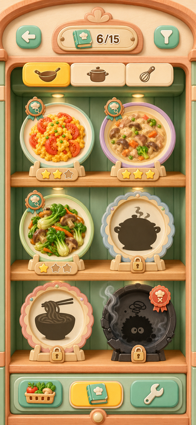

# 《料理消消研究所》G1-B 四页面概念方案 v0.1

> 日期：2026-07-21  
> 当前性质：ChatGPT 内的产品视觉策划，不是 Cocos 开发验收  
> 已选方向：B「果冻玩具厨房」  
> 基准尺寸：四张展示图均已整理为 390×844
> 评审结果：用户已确认四张均满意，作为后续策划的核心视觉概念基线

---

## 1. 本轮边界

本轮只用四张概念图确定：

1. B 风格的核心对局如何构图；
2. 连线、食材离格、飞入锅、锅内变化如何形成因果；
3. 料理揭晓如何同时表现菜谱稀有度与当局星级；
4. 菜谱图鉴如何像游戏收藏场景，而不是网页列表。

本轮不创建 Cocos 工程，不要求真实运行截图，不实现配方算法、正式关卡、广告或支付。

---

## 2. 页面一：核心对局与锅同屏

### 页面目的

让玩家一眼看懂“上方是订单，中间选择食材，下方是真实下锅区域”。棋盘和锅必须同时存在，不能等消除结束才切到一段做菜动画。

### 已确定结构

- 顶部：暂停、剩余采集次数/步数、设置；
- 订单托盘：目标料理预览、番茄需求 6、鸡蛋需求 5；
- 中央：7×7 棋盘，首章示例为番茄、鸡蛋、蘑菇、青菜、鸡肉五类；
- 下方：大号薄荷绿锅具，锅内显示未完成的番茄片和生鸡蛋；
- 锅体正面：三个投料灯，当前只亮第一个；
- 底部：撤回、洗牌、神秘调味料、开火。

### 需要保留的设计

- 锅不是角落状态图标，而是第二视觉中心；
- 食材轮廓差异明显，不依赖颜色辨认；
- 锅内是“未完成原料”，不能在对局中提前显示成品菜；
- 道具使用图形表达，避免文字卡片。

### 后续需修正

- 剩余步数徽章目前的双箭头容易被理解为洗牌，最终应改为“连线路径＋数字”；
- 订单预览应明确是成品剪影/目标菜，而不是另一口未完成的锅；
- 正式 UI 需要为刘海和底部手势区保留安全边距。

---

## 3. 页面二：连线并飞入锅中

### 页面目的

用一个画面完整表达：玩家选择番茄 → 番茄离开格子 → 沿单一路径飞入锅 → 锅内番茄增加 → 第二个投料灯开始点亮。

### 已确定表现

- 未选食材整体压暗约 25%；
- 被选番茄上浮、出现奶油金描边；
- 连线路径使用粗圆角发光线与节点，不使用闪电；
- 番茄沿一条弧线依次飞入锅中；
- 入锅点产生小型番茄汁飞溅与两颗金色星光；
- 锅内保留鸡蛋，同时明显增加番茄；
- 空位上方开始补充新食材；
- 第一投料灯已亮，第二投料灯进入充能，第三个保持熄灭。

### 动效节奏建议

| 时间 | 动作 |
| --- | --- |
| 0～120ms | 选中食材上浮、路径点亮 |
| 120～260ms | 食材离格，其他格压暗 |
| 260～650ms | 食材依次沿弧线飞入锅 |
| 480～720ms | 空位开始补盘 |
| 620～820ms | 锅体轻压、汁液飞溅、投料灯点亮 |
| 820～950ms | 画面恢复正常亮度 |

概念图中的连线长度只负责演示视觉；正式玩法必须严格按玩家真实选中的格数与路径生成。

---

## 4. 页面三：料理完成揭晓

### 页面目的

让料理成为整局最重要的奖励，而不是结算面板中的一张小图。

### 已确定结构

- 背景：同一厨房虚化、略压暗；
- 锅盖打开，食材粒子和蒸汽围绕料理；
- 番茄滑蛋占屏幕宽度约 70%，是最大视觉主体；
- 上方铜绿徽章：菜谱自身稀有度；
- 料理下方空白名牌：正式版本显示准确菜名；
- 三颗星中两颗点亮：本局烹饪质量为二星；
- 奖励区：金币、研究经验；
- 底部：收入图鉴、继续。

### 已解决的问题

- 不再在揭晓页放大号游戏 Logo；
- 稀有度徽章和烹饪星级分离；
- 料理尺寸远大于奖励数值和按钮；
- 食物比棋盘图标更油润、更有食欲，不完全像塑料玩具。

### 后续需修正

- 正式版本在空白名牌写入“番茄滑蛋”等准确中文；
- 金币图标统一为项目货币，不使用概念图里的临时爪印纹样；
- 普通、特色、珍稀、传说与黑暗标签需要分别制作演出变体。

---

## 5. 页面四：菜谱图鉴

### 页面目的

把图鉴做成一座真正存在于厨房里的料理收藏柜，避免后台列表和电商卡片。

### 已确定结构

- 顶部：返回、菜谱完成度 6/15、筛选；
- 分类：炒锅、汤锅、甜品三种实体按钮；
- 主体：三层木架，每层两个大盘位；
- 已解锁菜：完整料理、稀有度徽章、历史最佳星级；
- 未解锁菜：料理剪影、锁具；
- 黑暗料理：独立黑色盘位、烟雾和事故徽章；
- 底部：食材图鉴、菜谱图鉴、厨房升级三个实体抽屉按钮。

### 为什么不是网页网格

- 六个位置属于同一座柜体，而不是六张独立圆角卡片；
- 木架、射灯、盘架和抽屉形成真实场景层级；
- 菜品是被陈列的收藏物，不是商品信息；
- 黑暗料理也拥有专属收藏位，不等于最低品质或失败垃圾。

### 后续需修正

- 正式图鉴需要设计点击单道料理后的详情页；
- 同一盘位不能同时承载太多徽章、星级和食材线索；
- 分类按钮需要增加选中/未选中状态规范；
- 黑暗料理盘位仍保留自身普通/特色/珍稀稀有度信息。

---

## 6. 四张图共同锁定的 B 风格规则

### 视觉语言

- 薄荷绿、蜜桃珊瑚、黄油黄、暖奶油为主色；
- 2.5D 玩具黏土感，但不做幼儿角色和夸张表情；
- UI 像厨房中的实体器具，不像悬浮网页面板；
- 食材清晰圆润，成品料理额外增加湿润高光和蒸汽；
- 大按钮使用软材质和轻厚度，点击时允许轻压缩。

### 信息层级

1. 当前操作/料理；
2. 锅与结果反馈；
3. 订单和星级；
4. 道具、货币和次要导航。

### 明确禁止

- 游戏里直接使用整张概念图作为背景；
- 把概念图中的错误文字和临时图标照搬；
- 所有页面都变成六张圆角卡片；
- 为了模仿概念图而采用高成本实时 3D；
- 在未确认玩法前开始制作完整 Cocos 工程。

---

## 7. 评审结论与保留修正

用户已确认四张概念图均满意，以下内容正式保留：

1. B「果冻玩具厨房」继续作为主视觉方向；
2. 对局采用棋盘与大锅同屏的构图；
3. 食材离格、飞入锅和锅内变化必须形成连续因果；
4. 料理揭晓以料理为最大主体，并分离稀有度与当局星级；
5. 菜谱图鉴采用实体收藏柜，黑暗料理拥有独立事故盘位。

进入最终 UI 设计时仍需修正两项：

- 右上角剩余步数/采集次数图标不能与洗牌图标混淆；
- 订单托盘中的目标预览应为成品料理剪影或成品缩略图，不能像未完成锅中原料。

下一步继续留在 ChatGPT 中定稿核心玩法规则，不自动进入开发。
